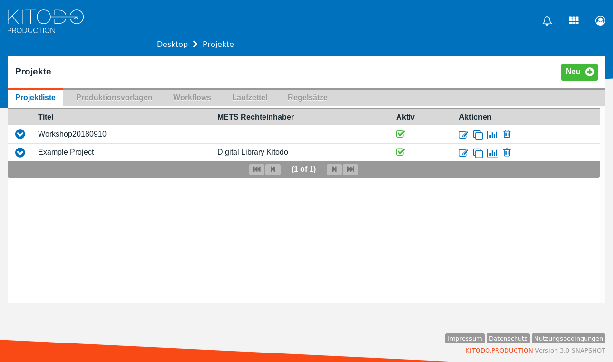

[kitodo-tutorials](../README.md) » [kitodo3](README.md) » 02_projekt-anlegen.md

# Projekt anlegen

Projekte in Kitodo.Production dienen der Verwaltung der Zugriffsbeschränkungen und projektbezogenen statistischen Auswertungen. Mehrere Projekte sind in der Regel dann notwendig, wenn Berichtspflichten bestehen.

Wir erstellen zunächst ein neues Projekt für unseren Workshop. Für diesen Schritt werden Administrationsrechte benötigt:

http://localhost:8080/kitodo/pages/projects.jsf

- Login: `testAdmin`
- Passwort: `test`

## Aufgabe: Projekt anlegen

Zum Anlegen eines Projektes gehen Sie wie folgt vor:

* Menü `Projekte` aufrufen, dort Button `Neu` / `Neues Projekt` klicken und folgende Angaben vornehmen:
  * Reiter Details
    * Titel: `Workshop20180910` 
    * Mandant:  `Client_ChangeMe` (dazu später mehr)
    * Weitere Felder wie Start- und Enddatum und Anzahl der Seiten/Bände sind optional
  * Reiter Technische Daten
    * Internes Speicherformat: `Mets`
    * DMS Exportformat: `Mets`
    * DMS-Export-Images-Ordner:  `/usr/local/kitodo/hotfolder/`
    * DMS-Export-Ordner für XML-Datei: `/usr/local/kitodo/hotfolder/`
    * DMS-Export-Error-Ordner: `/usr/local/kitodo/error_mets/`
    * DMS-Export-Success-Ordner: `/usr/local/kitodo/success/`
    * Automatischer DMS-Export: (ja)
    * Erzeuge Vorgangsordner: (nein)
    * Zeitüberschreitung (ms): `3600000`
  * Reiter Mets Parameter: Hier müssen zunächst noch keine Einstellungen vorgenommen werden. Diese Parameter dienen der Generierung der METS-Dateien für die spätere Präsentation der Digitalisate. Wenn Sie mögen, können Sie die Bedeutung der einzelnen Felder in der Anwenderdokumentation für Kitodo 1.x [Bearbeitung Projekte](https://github.com/kitodo/kitodo-production/wiki/Bearbeitung-Projekte) nachschlagen.

## Ergebnis

Nach Abschluss der Aufgabe sollte die Seite [Projekte](http://localhost:8080/kitodo/pages/projects.jsf) wie folgt aussehen:

------

Vorige Seite: <a href="01_arbeitsumgebung.md">1. Arbeitsumgebung</a> | Nächste Seite: <a href="03_benutzerkonfiguration.md">3. Benutzerkonfiguration</a>

