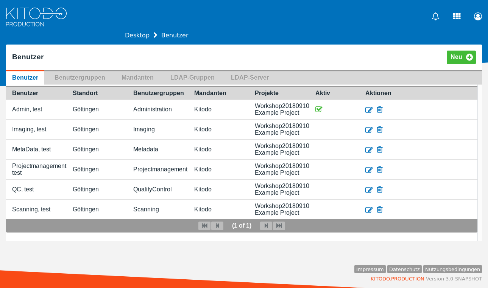

[kitodo-tutorials](../README.md) » [kitodo3](README.md) » 03_benutzerkonfiguration.md

# Benutzerkonfiguration

Neben der Verwaltung von Zugriffsbeschränkungen dient die Verwendung von unterschiedlichen Benutzergruppen auch einer besseren Usability bei der Durchführung einzelner Arbeitsschritte in Kitodo.Production. Es ist möglich, eine Benutzergruppe an eine Aufgabe im Workflow zu koppeln, so dass beispielsweise ein/e Scanoperator/in in der Aufgabenübersicht nur diejenigen offenen Vorgänge präsentiert bekommt, die sich im Arbeitsschritt Scannen befinden. Das sorgt versehentlicher Fehlbedienung vor und verbessert die Übersichtlichkeit.

Eine neue Funktionalität in Kitodo 3.x ist die Mandatenfähigkeit des Systems. Es können nun in einer Kitodo-Instanz Digitalisierungsprojekte für mehrere Mandanten verwaltet werden. Das Rechtemanagement ermöglicht die Vergabe von globalen Berechtigungen, Mandantenberechtigungen und Projektberechtigungen.

Wir legen zunächst die Benutzergruppen sowie eine Reihe von Benutzern für den Workshop an. Die Zuordnung von Berechtigungen erfolgt später in der Workflowkonfiguration. Auch für diesen Schritt werden Administrationsrechte benötigt:

http://localhost:8080/kitodo/pages/users.jsf

- Login: `testAdmin`
- Passwort: `test`

## Aufgabe: Benutzergruppen konfigurieren

Menü `Benutzer` / Tab `Benutzergruppen`

In den Beispieldaten sind bereits einige Benutzergruppen vorhanden. Im Bearbeitungsmodus können Sie Berechtigungen auf den drei Ebenen (global, mandantenspezifisch, projektspezifisch) zuweisen.

**Achtung:** In der Entwicklerversion werden hier noch technische Bezeichnungen dargestellt, dies wird noch überarbeitet. Außerdem werden die Berechtigungen erst nach einem Neustart der Applikation wirksam (Anleitung zum Neustart in Abschnitt Fehlerbehebung am Ende von Seite  <a href="01_arbeitsumgebung.md">1. Arbeitsumgebung</a>). Im weiteren Verlauf des Workshops werden wir daher ausschließlich mit dem Adminaccount `testAdmin` arbeiten.

## Aufgabe: Benutzer konfigurieren

Menü `Benutzer` / Tab `Benutzer`

Benutzer sind ebenfalls bereits eingerichtet. Editieren Sie diese und ergänzen Sie im Tab `Projektliste` das im vorigen Schritt angelegte Projekt.

## Aufgabe: Mandanten konfigurieren

Menü `Benutzer` / Tab `Mandanten`

Ändern Sie den Namen des Mandanten `Client_ChangeMe` in `Kitodo`

## Ergebnis

Nach Abschluss der Aufgaben sollte die Seite [Benutzer](http://localhost:8080/kitodo/pages/users.jsf) wie folgt aussehen:

## Hinweise

* In der Standardkonfiguration nutzt Kitodo.Production eine eigene Nutzerdatenbank anstelle von LDAP. Die Einstellung wird in der Datei [kitodo_config.properties ab Zeile 500](https://github.com/kitodo/kitodo-production/blob/master/Kitodo/src/main/resources/kitodo_config.properties#L500)  vorgenommen. Die Datei liegt hier an der Stelle `/var/lib/tomcat8/webapps/kitodo/WEB-INF/classes/kitodo_config.properties`.
* Wenn Sie weitere Mandanten anlegen und Benutzer diesen neuen Mandanten zuordnen, kann es in der Entwicklerversion erforderlich sein, dass Sie das Passwort des Benutzers neu setzen müssen, damit der Login weiterhin funktioniert. Lassen Sie den Account `Admin, test` (`testadmin`) unverändert, damit Sie sich nicht versehentlich aussperren.

------

Vorige Seite: <a href="02_projekt-anlegen.md">2. Projekt anlegen</a> | Nächste Seite: <a href="04_produktionsvorlage-anlegen-und-workflow-definieren.md">4. Produktionsvorlage anlegen und Workflow definieren</a>

